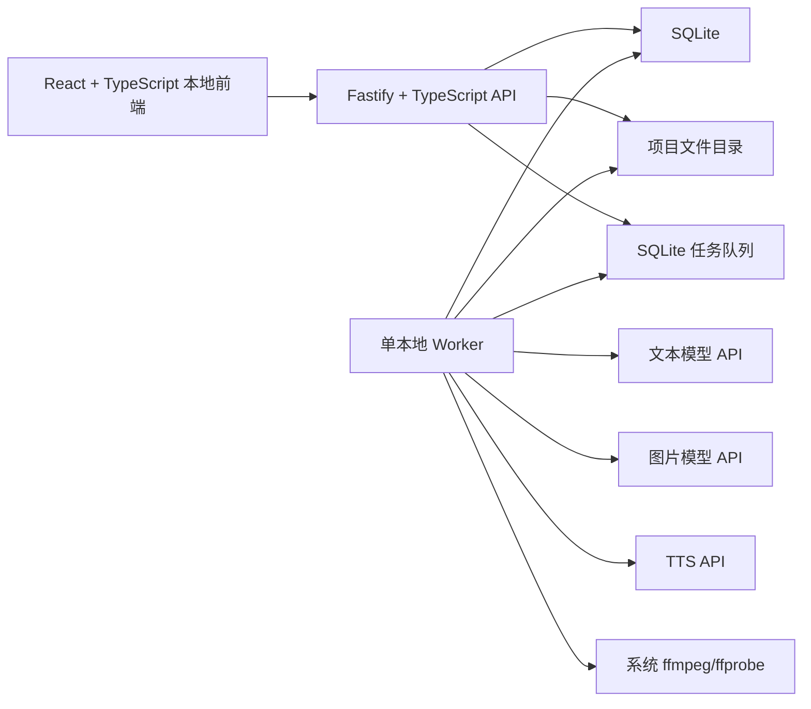

# 《北派盗墓笔记》AI 说书视频独立项目：设计与实施计划

> 日期：2026-07-24  
> 文档性质：新项目立项设计、代码抽取计划与分阶段实施基线  
> 前置总结：`D:\code3\MuseDock\docs\2026-07-24-north-tomb-video-project-summary.md`  
> 当前状态：设计已具备开工条件；项目名称、最终目录、首集章节、TTS 音色等可在创建新仓库时确认，不阻塞架构  
> 重要边界：本文设计的是一个全新的独立项目，不是在 MuseDock 中增加功能

## 1. 文档结论

创建一个新的、本地优先的 AI 长篇小说说书视频项目，暂用工作名“北派说书工场”。它以《北派盗墓笔记》作为第一本真实长篇书库，完成从大 TXT 导入到 9:16 静图说书视频导出的完整闭环。

第一版的核心不是复杂 AI 漫剧，而是可靠生产：

```text
长篇小说书库
-> 章节与结构化事件索引
-> 故事弧和分集原文证据
-> 忠实口播整理与包装
-> 人物、场景、道具资产
-> 视觉段和候选图片
-> TTS 与字幕时间轴
-> ffmpeg 静图微动和淡化
-> 分片渲染、恢复和导出
```

项目参考优先级冻结为：

1. DramaClaw：整体生产架构、小说摄入、章节图谱思想、分集、任务中心和恢复；
2. Toonflow：小说分析与改写工作区、章节按需取证、主资产/状态资产、候选图和显式绑定；
3. LumenX：Series/Episode、系列共享资产、候选选择和人物变体；
4. LocalMiniDrama：SQLite 项目结构、单项目包、TTS、SRT、FFmpeg 和生成历史；
5. MuseDock：已经验证的模型调用、TTS 时间轴、音频检查、镜头数学、工程检查点和 FFmpeg 能力。

首版不使用 Hugging Face，不使用图数据库，不使用无限画布，不使用 AI 视频生成，不使用 HyperFrames，不使用 Chrome/Playwright 逐帧渲染。

## 2. 不可变更的项目边界

### 2.1 它不是 MuseDock 的新功能

新项目必须拥有独立的：

- Git 仓库；
- `package.json` 和锁文件；
- 前端与后端入口；
- SQLite 数据库；
- 数据目录；
- 模型设置；
- 任务进程；
- 导出目录；
- 测试、构建和发布流程。

不得采用以下实现方式：

- 在 MuseDock 增加“北派模式”；
- 在 MuseDock 增加小说书库页面；
- 在 MuseDock 现有 creative workflow 中塞入长篇小说状态；
- 让新项目通过内部路径直接 `import` MuseDock 源码；
- 让新项目运行时要求 MuseDock 服务同时启动；
- 为方便复用而修改 MuseDock 的业务接口或数据结构；
- 把新项目数据库放进 MuseDock 的 `data` 目录。

本文档暂时保存在 MuseDock 的 `docs` 中，仅因为现阶段研究材料和源能力都在这里。新仓库创建后，应把本文复制到新仓库的 `docs/project-design.md`，以后以新仓库版本为准。

### 2.2 MuseDock 只作为源码供体

允许的复用方式按优先顺序为：

1. 抽取少量无业务含义的函数并复制到新项目；
2. 复制一个边界清晰的模块，再移除 MuseDock 配置和工作流依赖；
3. 对无法干净抽取的能力，根据已验证行为在新项目中做更窄实现；
4. 只有两个项目长期出现稳定的共同维护需求时，才考虑独立共享包。

首版不创建共享 monorepo 包。共享包会把两个仍在变化的项目绑在一起，当前收益不足。

## 3. 产品目标与首版范围

### 3.1 长期目标

- 支持约 500 万字、1791 章的《北派盗墓笔记》长期管理；
- 每个分集都能追溯到原文章节和字符范围；
- 保存人物、地点、器物、事件、未揭示信息和人物状态；
- 支持数百集连续生产而不重复创建人物资产；
- 支持人工审稿、人工选图和局部重做；
- 进程重启、接口失败或渲染失败后可以恢复；
- 最终支持 15～25 分钟说书视频的稳定批量生产。

### 3.2 MVP 目标

从《北派盗墓笔记》中选择一个完整小故事弧，产出一条 3～5 分钟、9:16、可人工审核、可重复生成和可局部重做的 MP4 样片。

MVP 必须做到：

- 导入 GBK/CP936 的整本 TXT；
- 识别并浏览全部章节；
- 保存章节字符偏移和原文哈希；
- 为选定章节生成结构化事件摘要；
- 选择故事弧并保存原文证据范围；
- 分别保存忠实整理稿和包装稿；
- 人工批准文案后才进入付费的 TTS 和生图；
- 创建主资产、少量状态资产和候选图；
- 将视觉段显式绑定到人物、场景和道具；
- 生成 8～15 张图片的联系表供人工审核；
- 生成 TTS、字幕和真实音频时长；
- 用 `ffmpeg` 完成静图微动、淡化、字幕和音频合成；
- 按 1～3 分钟分片渲染；
- 修改一段文案或一张图片后只重做受影响内容；
- 保存任务状态，重启后能识别并恢复中断任务；
- 导出完整 MP4、字幕和项目清单。

### 3.3 MVP 明确不做

- 一键自动生产整本书；
- 直接追求 20 分钟首片；
- AI 角色动画和口型同步；
- 文生视频或图生视频；
- 无限画布和通用节点系统；
- 三层或多层 Agent 编排；
- 向量记忆和图数据库；
- 3D/3GS 场景；
- 多套视觉模板；
- 浏览器逐帧视频渲染；
- 自动发布抖音；
- 多用户、权限、云队列和协作；
- 自动“爆款评分”；
- 插件市场、Skill 市场和在线执行任意供应商代码。

## 4. 已冻结的产品决策

| 决策项 | 首版决定 | 原因 |
|---|---|---|
| 产品形态 | 独立本地 Web 应用 | 开发和调试最简单，后续有必要再套 Electron |
| 运行时 | Node.js + TypeScript | 最容易抽取 MuseDock/Toonflow 能力，避免双运行时 |
| 前端 | React + TypeScript + Vite | 类型边界清晰，与现有开发经验一致 |
| 前端组件 | Tailwind CSS + `shadcn/ui` | 复用成熟通用控件，不自建按钮、表单和弹窗体系 |
| 后端框架 | Fastify + TypeScript | 原生支持 Schema 校验和流式请求，足够轻，不引入 NestJS 的 DI/装饰器体系 |
| 数据库 | SQLite | 本地、事务、可搬运，足以支撑单用户长篇项目 |
| 原文保存 | 原始文件 + 章节表 | 避免把整本书反复复制到 JSON |
| 章节分析 | SQLite 结构化事件 | MVP 不需要 Cognee 或图数据库 |
| 模型调用 | OpenAI-compatible/现有供应商适配 | 先复用验证过的调用边界 |
| TTS | 复用 MuseDock 已验证供应商路径 | 先跑通质量和时长，再扩供应商 |
| 视频渲染 | 系统 `ffmpeg` | 固定静图模板无需浏览器渲染 |
| 字幕 | SRT 保存，ASS 烧录 | SRT 便于交付，ASS 控制显示效果 |
| 时间轴 | 真实 TTS 时长驱动 | 不把音频强行压进预设画面时长 |
| 人物一致性 | 主资产 + 状态资产 + 候选图 + 人工选中 | 供应商能力不稳定，不能承诺全自动一致 |
| 工作流 | 固定阶段和人工闸门 | 比通用 Agent 更可控、更容易恢复 |
| 任务 | SQLite 持久化任务 + 单本地 Worker | 不引入 Redis/Celery，仅单用户本地使用 |
| 共享代码 | 新项目内复制、改造并记录来源 | 首版不引入跨仓库运行时依赖 |
| BGM | 首片默认关闭 | 先验证旁白、字幕和画面，减少变量 |
| 叙事人称 | 默认保留第一人称 | 是《北派盗墓笔记》的核心可信感来源 |

## 5. 参考项目如何吸收

### 5.1 DramaClaw：第一参考项目

参考仓库：[`dramaclaw/dramaclaw`](https://github.com/dramaclaw/dramaclaw)  
审查快照：`2864e72b3a717adbacfe09ded7b3ac6de2c2e28f`

#### 采用

- 小说是长期项目输入，而不是单次 Prompt；
- TXT/Markdown/DOCX 上传和编码处理边界；
- 章节预览包含标题、序号、行范围、正文和字符数；
- 原文、知识索引、人物和分集是不同层次的数据；
- 人物、关系、时间线、分集和资产形成完整生产链；
- 本地 SQLite + 文件目录；
- 每个阶段是独立任务；
- 任务中心提供状态、日志、取消、重试和恢复；
- 工作流可从任意已完成阶段继续；
- TTS、字幕、合成和交付是主流程的一部分，而不是外部手工步骤。

#### 首版改造

- 将 DramaClaw 的 Cognee 图谱替换为 SQLite 结构化章节事件表；
- 将“短剧/动态漫”分镜简化为旁白驱动的视觉段；
- 将视频生成主流程改为静态图片 + `ffmpeg`；
- 将完整任务平台压缩为单 Worker、SQLite Claim 和阶段检查点；
- 只保留人物、场景、道具和声音需要的最少资产字段。

#### 不采用

- Cognee 全文图谱作为 MVP 必需依赖；
- 一次性对 500 万字全文执行完整 LLM 图谱构建；
- 无限画布；
- Director World、3GS 和虚拟场景；
- 导演 Agent；
- 线稿分镜、视频池和 AI 视频生成；
- 复杂视觉质量平台；
- 社区版/商业版适配层。

#### 优先审查和移植的源码

| DramaClaw 文件 | 吸收内容 | 新项目处理方式 |
|---|---|---|
| `src/novelvideo/utils/document_parsers.py` | UTF-8/GBK/DOCX 文本读取边界 | 只移植 TXT 编码策略；DOCX 推迟到 MVP 后 |
| `src/novelvideo/cognee/chapter_detector.py` | 中文/英文章节标题规则和回退行为 | 将最小规则移植为 TypeScript，并增加字符偏移 |
| `src/novelvideo/api/chapter_preview.py` | 章节预览载荷 | 采用概念，避免返回整章正文列表造成超大响应 |
| `src/novelvideo/api/routes/ingest.py` | 安全文件名、流式落盘、大小限制、导入任务 | 采用边界，简化认证和项目上下文 |
| `src/novelvideo/utils/upload_safety.py` | 50MB 流式上传限制 | 用 Node 流和临时文件实现，成功后原子重命名 |
| `src/novelvideo/cognee/store.py` | 原文保存、分集原文、导入成功后再标记完成 | 采用事务和状态顺序，不移植 Cognee |
| `src/novelvideo/task_backend/` | 任务身份、Runner、取消检查 | 只移植任务语义，不复制整套框架 |
| `src/novelvideo/task_state.py` | 状态和项目任务查询 | 压缩成 SQLite `jobs` 表 |
| `src/novelvideo/sqlite_store.py` | 本地项目数据边界 | 参考迁移和事务模式，不复制整库模型 |

### 5.2 Toonflow：创作工作区和资产关系参考

参考仓库：[`HBAI-Ltd/Toonflow-app`](https://github.com/HBAI-Ltd/Toonflow-app)  
审查快照：`bc61ec7a1b5df31293b286981a5f4ad4635464ee`

#### 采用

- 每章独立存储、分页、搜索和单独分析；
- 先查询章节事件摘要，需要时再读取原文；
- 故事骨架、改编策略、分集稿等产物分层；
- 原文证据、AI 过程和最终稿分开；
- 项目是系列，剧本是分集；
- 人物、场景、道具作为长期主资产；
- 服装、受伤、年龄阶段等作为状态资产；
- 一项资产保存多个候选图，单独指向当前选中图；
- 分集与资产、视觉段与资产使用显式多对多关系；
- 批量任务支持未生成、生成中、失败、成功筛选；
- 图片联系表用于整集一致性人工审核；
- 提示词使用版本化 Markdown 文件。

#### 首版改造

- 自由文本事件摘要改为结构化 JSON 字段；
- 故事骨架/策略/剧本改成故事弧、忠实稿、包装稿、视觉段；
- 分镜改成旁白时间轴上的视觉段；
- 资产名称匹配改为稳定 ID + 别名 + 人工合并；
- 整库 JSON 恢复改为单项目包和哈希清单；
- 内存 Promise 后台任务改为 SQLite 持久化任务；
- “改状态即取消”改为 AbortSignal 或明确标记停止等待。

#### 不采用

- 整仓 fork；
- 完整 Toonflow 运行时依赖；
- 无限画布；
- 通用节点图片工作流；
- 多层 Agent；
- 向量 Agent 记忆；
- AI 视频轨道；
- 整库覆盖式导入；
- 在线执行任意 TypeScript 供应商代码；
- 编译后的前端产物复用。

### 5.3 LumenX：系列共享资产参考

参考仓库：[`alibaba/lumenx`](https://github.com/alibaba/lumenx)  
审查快照：`7a1213a0db73ab90ca976f5c4b4ca680e1ae1d2d`

采用以下概念：

- `Series -> Episodes`；
- 系列级共享人物、场景和道具；
- 稳定人物 UUID；
- 人物标准参考图和多个候选图；
- 当前选中、锁定、收藏和审核状态；
- `base_character_id` 式的角色变体关系；
- 前一集摘要和下一集承接信息。

不采用 LumenX 的小说导入实现，因为它只按 UTF-8 解码、分集只读取前 8 万字、全文暂存在内存，不适合约 500 万字书库。

### 5.4 LocalMiniDrama：本地生产实现参考

参考仓库：[`xuanyustudio/LocalMiniDrama`](https://github.com/xuanyustudio/LocalMiniDrama)  
审查快照：`b695284b8288e392a4ce2a63717406f3830966af`

优先参考：

- SQLite 项目、分集、分镜、人物、场景和道具结构；
- 单项目 ZIP 导入导出；
- 图片和视频生成历史；
- 持久化异步任务和前端恢复展示；
- 连戏状态 `continuity_snapshot`；
- 分段 TTS；
- SRT 生成；
- FFmpeg 字幕烧录；
- 列表和工作区使用同一业务数据源。

不采用：

- 默认只导入 20 章；
- 每章只取前 2000 字的短剧改写；
- 把旁白用 `atempo` 强行压进既定画面时长；
- FFmpeg 失败后退化为第一个视频仍报告完成；
- 无限画布；
- AI 视频优先流程。

### 5.5 MuseDock：已验证底层能力供体

MuseDock 只提供经过审查后可复制的底层实现，不承担新产品功能。

| MuseDock 候选文件 | 目标能力 | 抽取原则 |
|---|---|---|
| `server/services/ai/aiTtsModel.js` | TTS 供应商调用 | 移除全局配置和业务对象，仅保留请求、轮询、下载和错误映射 |
| `server/services/ai/aiImageModel.js` | 图片供应商调用 | 保留文本/参考图输入与结果归一化，移除 creative workflow |
| `server/services/tts/sceneTts.js` | 分段 TTS 和音频落盘 | 改成 episode/audio segment 输入 |
| `server/services/tts/ttsTimeline.js` | TTS 时间轴 | 复制纯函数和验证逻辑 |
| `server/services/tts/phraseTimeline.js` | 旁白切句与短语时间 | 复制纯函数，增加专有名词保护检查 |
| `server/services/tts/ttsAudioQuality.js` | 音频质量检查 | 保留静音、时长和可读性检查 |
| `server/services/creative-video/html-video/cameraMath.js` | 确定性推拉和平移参数 | 只抽纯数学，不带 HTML/DOM |
| `server/services/creative-video/html-video/ffmpegComposer.js` | FFmpeg 探测、执行和日志 | 只保留通用进程层，重写说书模板滤镜图 |
| `server/services/creative-video/html-video/projectStore.js` | 原子写入和工程检查点思路 | 参考行为，新项目以 SQLite 为业务真相 |
| `server/services/creative-video/html-video/projectOrchestrator.js` | 阶段恢复思路 | 不复制完整编排器，只提取状态转换和恢复规则 |

明确不抽取：

- Frame HTML 生成；
- `captionLayer.js` 的 DOM/HTML 渲染路径；
- `sceneImageSequenceDom.js`；
- Chrome/Playwright 渲染；
- HyperFrames/GSAP；
- MuseDock creative spec；
- 45～75 秒短视频预算；
- 通用布局 QA；
- 编辑器页面和全局设置页面。

## 6. 新项目推荐技术架构

### 6.1 后端框架选择：Fastify

后端确定使用 Fastify + TypeScript。

选择 Fastify 的理由：

- 路由、错误处理和生命周期钩子足以覆盖本地 API；
- 路由 Schema 可以在接口边界做输入校验和响应约束；
- 通过 `@fastify/multipart` 流式接收约 500 万字 TXT，不把全文塞进 JSON；
- 插件封装适合 SQLite 连接、模型配置和任务 Worker 生命周期；
- 原生异步模型适合供应商请求、文件 IO 和 FFmpeg 子进程；
- TypeScript 支持直接，不需要装饰器和反射元数据；
- 后续如果封装 Electron，Fastify 仍可作为本地服务运行。

不选择 Express：可以实现，但需要自行补齐接口 Schema、统一校验和较多边界样板，当前没有兼容旧 Express 中间件的需求。

不选择 NestJS：模块、依赖注入和装饰器适合更大的多人服务端，本项目首版是单用户本地生产工具，会增加目录、样板和调试层级。

不选择 Python/FastAPI：DramaClaw 使用 Python，但新项目主要抽取 MuseDock 和 Toonflow 的 Node.js 能力；引入第二运行时只为复用少量解析或图谱代码不划算。

首版后端依赖控制为：

- `fastify`：HTTP 框架；
- `@fastify/multipart`：大文件流式上传；
- SQLite 驱动：直接执行迁移和 SQL，不引入 ORM；
- 系统 `ffmpeg` / `ffprobe`：视频、字幕和音频处理；
- 供应商 SDK 只有在原生 `fetch` 无法可靠覆盖签名或上传协议时才加入。

API、Worker 和领域服务不使用依赖注入容器。Fastify 插件负责进程级资源，普通函数参数负责业务依赖。

### 6.2 进程结构



首版 API 和 Worker 可以运行在同一 Node 进程，但代码边界保持独立。任务必须先写入 SQLite，再由 Worker Claim，不能依赖 HTTP 请求存活。

### 6.3 推荐目录

```text
<new-project-root>/
├─ apps/
│  ├─ web/                 # React + TypeScript + Vite
│  └─ server/              # Fastify API + Worker
├─ packages/
│  └─ core/                # 纯类型、解析器、时间轴和状态规则
├─ prompts/                # 版本化 Markdown 提示词
├─ migrations/             # SQLite 迁移
├─ docs/
│  ├─ project-design.md
│  ├─ source-provenance.md
│  └─ decisions/
├─ tests/
├─ data/                   # 默认不提交
└─ exports/                # 默认不提交
```

如果创建仓库时发现 `packages/core` 只被 server 使用，则取消该目录，直接放入 `apps/server/src/core`。不要为了“以后共享”保留空包。

### 6.4 项目数据目录

```text
data/
├─ app.db
├─ books/<book-id>/
│  ├─ source/original.txt
│  ├─ source/manifest.json
│  └─ backups/
└─ projects/<project-id>/
   ├─ assets/
   │  ├─ characters/
   │  ├─ scenes/
   │  └─ props/
   ├─ episodes/<episode-id>/
   │  ├─ scripts/
   │  ├─ images/
   │  ├─ audio/
   │  ├─ subtitles/
   │  ├─ contactsheets/
   │  ├─ render-chunks/
   │  └─ exports/
   └─ backups/
```

SQLite 保存结构化元数据、关系、状态和相对路径。大型原文、图片、音频、视频不写入 BLOB。

## 7. 核心数据模型

首版使用关系表作为唯一业务真相，不把完整工作区再复制进一个大 JSON。

### 7.1 书库

#### `books`

- `id`
- `title`
- `author`
- `source_path`
- `stored_path`
- `encoding`
- `source_sha256`
- `char_count`
- `chapter_count`
- `import_status`
- `created_at`
- `updated_at`

#### `chapters`

- `id`
- `book_id`
- `chapter_index`
- `source_number`
- `volume_title`
- `title`
- `start_offset`
- `end_offset`
- `char_count`
- `content_sha256`
- `analysis_status`
- `analysis_error`

唯一身份使用 `id`，排序使用 `chapter_index`。不得用可能跨卷重复的“第 101 章”作为唯一键。

#### `chapter_events`

- `id`
- `chapter_id`
- `event_index`
- `summary`
- `characters_json`
- `locations_json`
- `props_json`
- `causes_json`
- `results_json`
- `reveals_json`
- `unresolved_json`
- `risk_or_cost`
- `visual_value`
- `hook_candidate`
- `cliffhanger_candidate`
- `source_start_offset`
- `source_end_offset`
- `prompt_version`
- `input_hash`

JSON 字段只保存事件内部的小型数组，不保存整章正文。

### 7.2 系列和分集

#### `series_projects`

- `id`
- `book_id`
- `name`
- `description`
- `narration_person`
- `visual_style`
- `aspect_ratio`
- `default_text_model`
- `default_image_model`
- `default_tts_model`
- `current_episode_id`
- `created_at`
- `updated_at`

#### `episodes`

- `id`
- `series_project_id`
- `episode_number`
- `title`
- `status`
- `target_duration_sec`
- `current_stage`
- `previous_summary`
- `next_hook`
- `approved_script_version_id`
- `created_at`
- `updated_at`

#### `episode_sources`

- `episode_id`
- `chapter_id`
- `source_start_offset`
- `source_end_offset`
- `usage_type`：`primary` / `context` / `omitted`
- `notes`

### 7.3 改编工作区

#### `script_versions`

- `id`
- `episode_id`
- `kind`：`faithful` / `packaged` / `approved`
- `version`
- `content`
- `source_map_json`
- `upstream_version_id`
- `prompt_version`
- `input_hash`
- `review_status`
- `review_notes`
- `created_at`

忠实稿和包装稿必须分开。重新生成包装稿不能覆盖忠实稿；批准后的稿件不可静默修改，只能创建新版本。

### 7.4 资产与候选图

#### `assets`

- `id`
- `series_project_id`
- `type`：`character` / `scene` / `prop`
- `base_asset_id`
- `name`
- `description`
- `structured_spec_json`
- `stage_scope`
- `locked_fields_json`
- `selected_candidate_id`
- `review_status`
- `created_at`
- `updated_at`

`base_asset_id` 为空表示主资产；非空表示服装、年龄、伤势或阶段状态资产。

#### `asset_aliases`

- `asset_id`
- `alias`

“我”“云峰”“项云峰”通过别名归一，模型抽取结果先进入人工确认，不直接按名称创建新人物。

#### `asset_candidates`

- `id`
- `asset_id`
- `file_path`
- `source_type`：`generated` / `uploaded`
- `model`
- `prompt`
- `reference_candidate_ids_json`
- `provider_task_id`
- `seed`
- `width`
- `height`
- `status`
- `review_status`
- `error_message`
- `created_at`

生成失败不得覆盖已选图片。

### 7.5 视觉、音频和渲染

#### `visual_segments`

- `id`
- `episode_id`
- `segment_index`
- `narration_start_char`
- `narration_end_char`
- `start_ms`
- `end_ms`
- `description`
- `image_prompt`
- `selected_candidate_id`
- `shot_type`
- `camera_motion_json`
- `fade_ms`
- `review_status`
- `render_status`

#### `visual_segment_assets`

- `visual_segment_id`
- `asset_id`
- `role`

#### `audio_segments`

- `id`
- `episode_id`
- `segment_index`
- `text`
- `file_path`
- `duration_ms`
- `model`
- `voice`
- `input_hash`
- `status`
- `error_message`

#### `subtitle_cues`

- `id`
- `episode_id`
- `cue_index`
- `start_ms`
- `end_ms`
- `text`
- `source_audio_segment_id`

#### `render_chunks`

- `id`
- `episode_id`
- `chunk_index`
- `start_ms`
- `end_ms`
- `input_hash`
- `file_path`
- `status`
- `ffmpeg_log_path`
- `error_message`

#### `exports`

- `id`
- `episode_id`
- `version`
- `file_path`
- `subtitle_path`
- `manifest_path`
- `duration_ms`
- `input_hash`
- `created_at`

### 7.6 持久化任务

#### `jobs`

- `id`
- `project_id`
- `episode_id`
- `type`
- `scope_type`
- `scope_id`
- `status`
- `input_hash`
- `payload_json`
- `attempt`
- `max_attempts`
- `progress`
- `progress_message`
- `worker_id`
- `lease_expires_at`
- `cancel_requested_at`
- `started_at`
- `finished_at`
- `error_code`
- `error_message`
- `retryable`
- `created_at`

状态机：

```text
pending -> running -> succeeded
                   -> failed
                   -> cancelled
                   -> interrupted
```

应用启动时，超过租约的 `running` 任务改为 `interrupted`。用户可以重新入队；相同 `input_hash` 已有成功产物时直接复用。

## 8. 核心工作流

### 8.1 小说导入

1. 用户选择本地 TXT；
2. 服务端流式复制到临时文件并计算 SHA-256；
3. 使用 Node 原生 `TextDecoder` 按 UTF-8、GB18030 顺序尝试；
4. 统一换行符但保留字符偏移映射；
5. 用章节规则扫描全文；
6. 写入 `books` 和 `chapters` 事务；
7. 原始文件原子移动到书库目录；
8. 返回章节数量、异常标题和重复编号报告。

GBK/CP936 是 GB18030 的兼容子集，首版优先使用平台原生解码，不为此新增 `iconv-lite`。只有目标 Node 版本实际不支持 GB18030 时再增加依赖。

导入验收：

- 《北派盗墓笔记》约 4,996,433 字符可以导入；
- 识别约 1791 个章节标记；
- 任一章节可以按偏移从保存原文中精确回读；
- 重复章节号不会覆盖；
- 重复导入相同哈希不会创建第二份书库；
- 导入失败不留下“完成”状态。

### 8.2 章节事件分析

1. 用户选择章节范围；
2. 每章创建一个持久化分析任务；
3. Worker 只发送该章正文和必要的前后章摘要；
4. 模型返回结构化事件；
5. 校验事件原文范围和必填字段；
6. 写入 `chapter_events`；
7. 失败章节可单独重试。

MVP 并发默认为 2。不要为了速度默认 5～10 并发，先控制模型限流和成本。

### 8.3 故事弧与分集

1. 用户浏览章节事件和原文；
2. 系统按目标字数提供相邻章节候选；
3. 模型只建议故事弧起止点和理由；
4. 用户确认本集原文范围；
5. 创建 `episode_sources`；
6. 保存本集已知信息、未揭示信息和下一集候选悬念。

不能机械规定“每章一集”或“每三章一集”。3～5 分钟首片目标口播约 1000～1800 字。

### 8.4 忠实改编与包装

固定三步：

```text
原文证据
-> 忠实整理稿
-> 包装稿
-> 人工批准稿
```

忠实整理只允许口语化、明确对话归属、消除代词歧义、合并不影响情节的重复动作、统一专有名词和控制长度，不允许改变事件顺序和因果。

包装稿只增加：

- 开头问题或代价钩子；
- 一句前情复位；
- 必要过渡；
- 结尾具体悬念；
- 少量固定主播口吻。

默认保留第一人称。批准前不创建 TTS 和生图任务。

### 8.5 资产和视觉段

1. 从批准稿抽取人物、场景、道具候选；
2. 用别名匹配已有资产；
3. 用户确认复用、创建或合并；
4. 为主要人物创建主资产；
5. 只有跨多个视觉段重复的服装/受伤状态才建状态资产；
6. 按旁白语义划分视觉段；
7. 将视觉段绑定资产并生成图片候选；
8. 用户选择当前图；
9. 生成 8～15 张联系表进行整集审核。

单次轻微表情或光线变化放在视觉段提示词中，不创建新状态资产。

### 8.6 TTS、字幕和时间轴

1. 按语义和供应商上限切分批准稿；
2. 逐段生成 TTS 并立即落盘；
3. 用 `ffprobe` 读取每段真实时长；
4. 生成短语时间轴和字幕断句；
5. 拼接音频并保存总时长；
6. 用真实时间轴回填视觉段；
7. 导出 SRT 和用于烧录的 ASS。

禁止以预设画面时长为目标对旁白做激进加速。正常语速、停连和听感优先。

### 8.7 FFmpeg 渲染

唯一模板：

- 1080×1920；
- 30fps；
- H.264 + AAC；
- 全屏 `cover` 裁切；
- 缓慢推近或 1%～2% 平移；
- 0.4～0.8 秒淡化；
- 白色双行字幕、描边、阴影和安全区；
- 轻暗角；
- BGM 默认关闭。

按 1～3 分钟生成 `render_chunks`。所有分片使用相同编码参数，最终优先 concat；参数不一致时明确失败，不能静默退化为首片段。

## 9. 失效传播和局部重做

首版只实现下面这些确定规则：

| 修改内容 | 必须失效 |
|---|---|
| 章节原文或原文范围 | 章节事件、分集稿、视觉段、TTS、字幕、渲染 |
| 忠实稿 | 包装稿、批准稿及所有下游 |
| 包装稿/批准稿 | 视觉段、TTS、字幕、渲染 |
| 人物当前选中图 | 引用该人物且需要参考图的视觉候选、相关渲染分片 |
| 单张视觉图 | 包含该视觉段的渲染分片和最终导出 |
| TTS 音频 | 对应字幕时间轴、视觉时间和相关渲染分片 |
| 字幕文本 | 相关渲染分片和最终导出 |
| 模板参数 | 全部渲染分片和最终导出 |

失效通过输入哈希判断，不在各页面手写不同规则。每种产物的输入哈希只包含真正影响该产物的上游版本和配置。

## 10. UI 信息架构

首版采用固定步骤，不做无限画布。

### 10.1 页面

1. 书库：导入、章节数量、编码、哈希和异常报告；
2. 项目：首页显示当前分集、阶段、失败任务、待审核项和最近导出；
3. 章节：分页、搜索、原文和事件分析；
4. 分集：故事弧范围、原文证据、忠实稿、包装稿和审稿；
5. 资产：人物、场景、道具、状态资产、别名和候选图；
6. 视觉：视觉段列表、绑定资产、候选图和联系表；
7. 音频：TTS 分段、声音、实际时长和字幕；
8. 渲染：分片、日志、失败重试、预览和导出；
9. 设置：模型、TTS、图片、FFmpeg 路径和默认模板。

### 10.2 每个异步操作必须显示

- 正在执行什么；
- 当前进度；
- 成功、失败、中断或取消；
- 是否可重试；
- 是否可能仍在供应商侧计费；
- 失败原因和下一步操作。

请求期间按钮禁用，避免重复提交。同一输入哈希存在运行中任务时不创建重复任务。

## 11. 代码抽取执行规则

每次从参考仓库抽取代码时，按以下顺序执行：

1. 先确认新项目确实需要该能力；
2. 搜索新项目是否已经有可用实现；
3. 优先使用 Node 标准库或系统 `ffmpeg`；
4. 再审查候选源文件的所有调用方和依赖；
5. 只复制最小闭包；
6. 删除原项目业务对象、全局配置和 UI 依赖；
7. 改成新项目领域类型；
8. 添加一个能覆盖主要失败边界的最小测试；
9. 在 `docs/source-provenance.md` 记录仓库、提交、源文件和修改说明；
10. 不在抽取过程中顺手重构源项目。

每个抽取项只有三种结论：

- `copy`：纯函数或边界清晰，复制并改名；
- `port`：思想正确但语言或业务不同，按行为重写；
- `reference-only`：复杂度或耦合过高，只参考设计。

初始分类：

| 能力 | 来源 | 结论 |
|---|---|---|
| TXT 解码 | DramaClaw + Node `TextDecoder` | `port` |
| 章节检测 | DramaClaw | `port` |
| 章节事件与按需原文 | Toonflow | `reference-only` 后自行实现 |
| TTS 供应商调用 | MuseDock | 审查后 `copy` 或 `port` |
| TTS 时间轴纯函数 | MuseDock | 优先 `copy` |
| 音频质量检查 | MuseDock | 优先 `copy` |
| 资产候选和选择 | Toonflow/LumenX | `reference-only` 后自行实现 |
| 连戏状态 | LocalMiniDrama | `reference-only` 后自行实现最小字段 |
| 相机运动数学 | MuseDock | 优先 `copy` |
| SRT/字幕烧录 | LocalMiniDrama + MuseDock | `port` |
| FFmpeg 进程和探测 | MuseDock | 审查后 `copy` |
| 说书滤镜图 | 无现成完全匹配实现 | 新项目最小实现 |
| 持久化任务 | DramaClaw/Toonflow | `reference-only`，新建轻量 SQLite Worker |
| 单项目包 | LocalMiniDrama | `port` |

## 12. 分阶段实施计划

### Phase 0：创建独立仓库

交付：

- 新 Git 仓库；
- Fastify/TypeScript、React/TypeScript/Vite、SQLite 和测试脚本；
- 独立数据目录和 `.gitignore`；
- `ffmpeg`/`ffprobe` 启动检查；
- `docs/project-design.md` 和 `docs/source-provenance.md`；
- 一个空项目首页和健康检查。

验收：

- 不修改 MuseDock 业务代码；
- 新项目可在 MuseDock 未运行时独立启动；
- 未配置模型时提供中文可操作提示；
- 缺少 FFmpeg 时启动检查明确失败原因。

### Phase 1：书库、编码与章节索引

交付：

- 大 TXT 流式导入；
- UTF-8、GB18030 解码；
- 章节检测、偏移、哈希和重复编号处理；
- 书库和章节浏览；
- 导入报告和最小解析测试。

验收使用真实《北派盗墓笔记》文件，不只用小样例。

### Phase 2：持久化任务和章节事件

交付：

- `jobs` 表和单 Worker；
- Claim、租约、中断恢复、重试和取消请求；
- 章节结构化事件提示词；
- 分页批量分析和失败筛选；
- 输入哈希去重。

验收：分析任务运行中强制退出进程，重启后任务显示 `interrupted` 并可恢复，不丢已完成章节。

### Phase 3：故事弧、分集和忠实改编

交付：

- 章节事件和原文并排选择；
- 故事弧建议；
- `episode_sources`；
- 忠实稿、包装稿和批准稿版本；
- 来源映射和人工审稿闸门；
- 北派第一人称提示词。

验收：批准稿中的主要事件顺序、人物关系和因果可回溯原文；未批准不能进入 TTS/生图。

### Phase 4：TTS 和字幕先行闭环

交付：

- 从 MuseDock 抽取最小 TTS 调用；
- 语义切段；
- 逐段落盘；
- `ffprobe` 实际时长；
- SRT/ASS；
- 音频质量检查；
- 专有名词词典入口。

验收：可以只用黑底或占位图导出一条完整、有声、有字幕的 3～5 分钟验证视频。这样先证明最关键的旁白时间轴，不等待资产系统完成。

### Phase 5：资产、候选图和视觉段

交付：

- 人物/场景/道具主资产；
- 别名和人工合并；
- 少量状态资产；
- 候选图历史和当前选中图；
- 视觉段和资产绑定；
- 批量生图；
- 8～15 张联系表。

验收：更换一个人物主参考图时，可以准确列出受影响视觉段；生成失败不会覆盖当前图。

### Phase 6：FFmpeg 固定模板和分片恢复

交付：

- 唯一 9:16 模板；
- `cover`、轻推拉/平移、淡化、暗角和 ASS 字幕；
- 1～3 分钟分片；
- 分片输入哈希；
- concat 导出；
- FFmpeg 日志；
- 黑帧、缺图、缺字幕、静音和总时长检查。

验收：故意让一个分片失败，修复后只重渲染该分片；修改一张图片后不重做 TTS 和其他分片。

### Phase 7：项目包和首条真实样片

交付：

- 单项目 ZIP；
- 版本、清单和 SHA-256 校验；
- 在空数据目录导入恢复；
- 第一条真实 3～5 分钟样片；
- 实际模型费用、耗时、失败率和人工耗时记录。

验收：项目包不覆盖其他项目；恢复后可继续编辑和重新导出相同结果。

### Phase 8：数据验证后再扩展

只有首片完成并获得实际反馈后，才决定是否进入：

- 8～10 分钟；
- 15～25 分钟；
- BGM；
- 更强参考图一致性；
- 更多模板；
- 更高章节分析并发；
- 向量检索或图谱；
- Electron 打包；
- 发布数据看板。

## 13. MVP 验收清单

### 13.1 功能

- [ ] 新项目独立启动，不依赖 MuseDock 运行；
- [ ] 成功导入真实北派 GBK TXT；
- [ ] 章节数量、顺序、偏移和哈希可检查；
- [ ] 章节事件可以局部生成和失败重试；
- [ ] 分集原文证据可追溯；
- [ ] 忠实稿、包装稿和批准稿版本分离；
- [ ] 人工批准是付费下游的硬闸门；
- [ ] 主资产、状态资产、别名和候选图可用；
- [ ] 视觉段与资产显式绑定；
- [ ] TTS 使用真实时长；
- [ ] SRT 和 ASS 可导出；
- [ ] 8～15 张图片联系表可审核；
- [ ] FFmpeg 能完成唯一模板；
- [ ] 分片失败可以恢复；
- [ ] 局部修改只重做必要下游；
- [ ] 单项目包可以恢复；
- [ ] 导出 3～5 分钟 MP4。

### 13.2 质量

- [ ] 旁白保持第一人称和原始因果；
- [ ] 专有名词无明显误读；
- [ ] 字幕最多两行且不进入平台底部危险区；
- [ ] 无黑帧、缺图、明显静音和音画截断；
- [ ] 人物主要外观在本集内可接受；
- [ ] 开头 15 秒有 3～4 个有效画面变化；
- [ ] 正文换图节奏不机械；
- [ ] 结尾是具体故事悬念，CTA 最多一句。

### 13.3 恢复与数据安全

- [ ] 原文导入使用临时文件和原子重命名；
- [ ] 数据库变更使用事务；
- [ ] 运行中任务重启后不会假装成功；
- [ ] 已完成产物不会因失败重试被覆盖；
- [ ] 删除项目经过确认，MVP 可先只支持移入回收站；
- [ ] 项目包导入前校验版本、清单和哈希；
- [ ] 日志不记录 API Key、Token 和完整敏感请求头。

## 14. 开工前不阻塞的待确认项

这些选择不会改变本文架构，可以在 Phase 0 或对应阶段确认：

| 待确认项 | 默认值 | 最晚确认时间 |
|---|---|---|
| 正式项目名称 | 北派说书工场（工作名） | 创建仓库前 |
| 仓库目录 | `D:\code3\north-tomb-story-video` | 创建仓库前 |
| 首集章节范围 | 从短小、人物不多、冲突完整的故事弧中选择 | Phase 3 前 |
| TTS 供应商和音色 | 先复用 MuseDock 当前可用供应商，做 3 个声音盲听 | Phase 4 前 |
| TTS 语速 | 先以自然听感为准，不追求样本的 330～370 字/分钟 | Phase 4 前 |
| 生图供应商 | 使用当前可用模型；有参考图能力则启用，没有则文本前缀 + 人工审核 | Phase 5 前 |
| 单集成本上限 | 首片记录实际成本后确定 | Phase 7 后 |
| BGM | 关闭 | Phase 8 决策 |
| Electron | 不做 | 真实需要桌面安装包时 |

## 15. 何时才需要升级架构

只有出现以下真实信号时才增加对应复杂度：

| 真实问题 | 才考虑的升级 |
|---|---|
| SQLite 结构化事件无法表达或查询跨数百章关系 | Cognee、图数据库或向量索引 |
| 单 Worker 明显拖慢本地生产 | 多 Worker 和更严格租约，不先上 Redis |
| 两个项目反复修同一供应商模块 | 抽独立共享包 |
| 固定模板无法表达验证过的高价值画面 | HyperFrames/浏览器渲染或第二模板 |
| 用户需要大量非线性版本和自由组合 | 无限画布 |
| 静图内容真实数据明显弱于动态视频 | 选择性加入图生视频 |
| 本地 Web 启动成为实际使用障碍 | Electron 打包 |
| 第一人称 TTS 无法处理多角色对话 | 多角色声音和对白轨道 |

## 16. 开工顺序

下一步不是修改 MuseDock，而是：

```text
确认新项目名和目录
-> 创建独立 Git 仓库
-> 复制本文到新仓库
-> Phase 0 独立骨架
-> Phase 1 真实北派 TXT 导入
-> Phase 2 持久化任务和章节事件
-> Phase 3 忠实改编与审稿
-> Phase 4 TTS/字幕先行验证
-> Phase 5 资产和图片
-> Phase 6 FFmpeg 分片成片
-> Phase 7 首条真实样片和项目包
```

开工时只需用户确认两个值：正式项目名称和仓库目录。首集章节、TTS 音色和图片模型可以在对应阶段用真实结果选择，不需要现在一次决定完。
